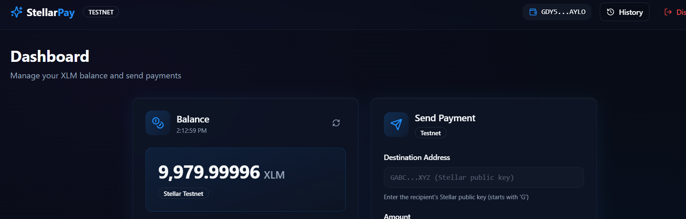

# StellarPay - XLM Payment dApp

A modern, user-friendly decentralized application for sending XLM payments on the Stellar Testnet. Built with React, TypeScript, and integrated with Freighter wallet for secure transaction signing.


## 🌟 Features

- **🔐 Secure Wallet Integration** - Connect your Freighter wallet with one click
- **💰 Real-time Balance** - View your XLM balance with auto-refresh
- **⚡ Instant Payments** - Send XLM to any Stellar address in seconds
- **📊 Transaction History** - Track all your payments with detailed information
- **🎨 Modern UI** - Beautiful, responsive interface with smooth animations
- **🔄 Network Verification** - Automatic Testnet network detection
- **📱 Mobile Responsive** - Works seamlessly on all devices

## 🚀 Quick Start

### Prerequisites

- Node.js (v16 or higher)
- npm or yarn
- [Freighter Wallet](https://www.freighter.app/) browser extension

### Installation

1. **Clone the repository**
   ```bash
   git clone https://github.com/Samrat25/stellar-journey-frontend-challenge.git
   cd stellar-journey-frontend-challenge
   ```

2. **Install dependencies**
   ```bash
   npm install
   ```

3. **Start the development server**
   ```bash
   npm run dev
   ```

4. **Open your browser**
   ```
   Navigate to http://localhost:8080
   ```

### Building for Production

```bash
npm run build
```

The built files will be in the `dist/` directory.

## 📖 How to Use

### 1. Install Freighter Wallet

- Visit [freighter.app](https://www.freighter.app/)
- Install the browser extension
- Create a new wallet or import an existing one
- **Important:** Switch to Testnet in Freighter settings

### 2. Get Test XLM

- Connect your wallet in the app
- Click "Fund with Friendbot" to get 10,000 test XLM
- Wait a few seconds for the transaction to complete

### 3. Send Your First Payment

- Enter the recipient's Stellar address (starts with 'G')
- Enter the amount of XLM to send
- Click "Send Payment"
- Approve the transaction in Freighter
- Done! 🎉

## 📸 Screenshots

### Landing Page
*Beautiful hero section with call-to-action*


### Wallet Connected State
*Freighter wallet successfully connected with address displayed*



### Balance Displayed
*Real-time XLM balance with refresh functionality*


### Send Payment
*Clean payment form with validation*


### Successful Transaction
*Transaction confirmation with hash and explorer link*


### Transaction History
*Complete transaction history with detailed information*


## 🏗️ Tech Stack

### Frontend
- **React 18** - UI framework
- **TypeScript** - Type safety
- **Vite** - Build tool and dev server
- **Tailwind CSS** - Styling
- **shadcn/ui** - Component library

### Blockchain
- **Stellar SDK** - Blockchain interactions
- **Freighter API** - Wallet integration
- **Horizon API** - Stellar network communication

### Additional Libraries
- **React Router** - Navigation
- **Sonner** - Toast notifications
- **Lucide React** - Icons
- **TanStack Query** - Data fetching

## 📁 Project Structure

```
stellarpay-dapp/
├── src/
│   ├── components/          # React components
│   │   ├── ui/             # shadcn/ui components
│   │   ├── Balance.jsx     # Balance display
│   │   ├── SendPayment.jsx # Payment form
│   │   ├── WalletConnect.jsx # Wallet connection
│   │   └── TransactionHistory.jsx
│   ├── pages/              # Page components
│   │   ├── Landing.tsx     # Landing page
│   │   ├── Connect.tsx     # Wallet connection page
│   │   ├── Dashboard.tsx   # Main dashboard
│   │   └── History.tsx     # Transaction history
│   ├── stellar/            # Stellar SDK utilities
│   │   └── stellarClient.js
│   ├── App.tsx             # App root with routes
│   └── main.tsx            # Entry point
├── public/                 # Static assets
├── screenshots/            # App screenshots
└── package.json
```

## 🔧 Configuration

### Network Settings

The app is configured for Stellar Testnet by default:

```javascript
const HORIZON_URL = "https://horizon-testnet.stellar.org";
const NETWORK_PASSPHRASE = StellarSdk.Networks.TESTNET;
```

To switch to Mainnet (not recommended for this app):
1. Update `HORIZON_URL` to `https://horizon.stellar.org`
2. Update `NETWORK_PASSPHRASE` to `StellarSdk.Networks.PUBLIC`
3. Update Freighter to Mainnet

## 🧪 Testing

### Run Tests
```bash
npm test
```

### Run Tests in Watch Mode
```bash
npm run test:watch
```


```

## 🔐 Security

- **Non-custodial** - Your keys never leave your Freighter wallet
- **Testnet Only** - Uses test XLM with no real value
- **Transaction Signing** - All transactions signed locally in Freighter
- **Network Verification** - Automatic network mismatch detection

## 🤝 Contributing

Contributions are welcome! Please feel free to submit a Pull Request.

1. Fork the repository
2. Create your feature branch (`git checkout -b feature/AmazingFeature`)
3. Commit your changes (`git commit -m 'Add some AmazingFeature'`)
4. Push to the branch (`git push origin feature/AmazingFeature`)
5. Open a Pull Request

## 📝 License

This project is licensed under the MIT License - see the [LICENSE](LICENSE) file for details.

## 🙏 Acknowledgments

- Built for the **Stellar Journey to Mastery** - Level 1 White Belt Challenge
- Powered by [Stellar](https://stellar.org)
- Wallet integration by [Freighter](https://freighter.app)
- UI components by [shadcn/ui](https://ui.shadcn.com)

## 📞 Support

- **Stellar Documentation**: [developers.stellar.org](https://developers.stellar.org)
- **Freighter Documentation**: [docs.freighter.app](https://docs.freighter.app)
- **Stellar Discord**: [discord.gg/stellar](https://discord.gg/stellar)

## 🎯 Roadmap

- [ ] Multi-asset support (not just XLM)
- [ ] Transaction memos
- [ ] Address book
- [ ] QR code scanning
- [ ] Transaction filtering
- [ ] Export history (CSV)
- [ ] Dark/light theme toggle
- [ ] Multiple language support

---

**Made with ❤️ for the Stellar Community**
